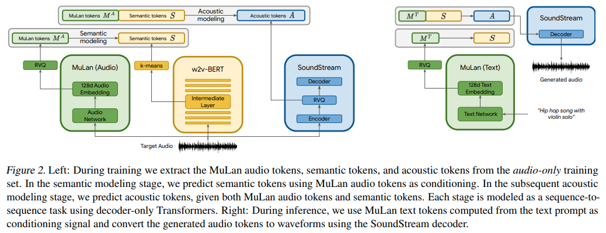

</img>

## MusicLM - Pytorch

Implementation of <a href="https://google-research.github.io/seanet/musiclm/examples/">MusicLM</a>, Google's new SOTA model for music generation using attention networks, in Pytorch.

They are basically using text-conditioned <a href="https://github.com/lucidrains/audiolm-pytorch">AudioLM</a>, but surprisingly with the embeddings from a text-audio contrastive learned model named <a href="https://arxiv.org/abs/2208.12415">MuLan</a>. MuLan is what will be built out in this repository, with AudioLM modified from the other repository to support the music generation needs here.

Please join <a href="https://discord.gg/xBPBXfcFHd"></a> if you are interested in helping out with the replication with the <a href="https://laion.ai/">LAION</a> community

<a href="https://www.youtube.com/watch?v=jTrYIGxOuKQ">What's AI by Louis Bouchard</a>

## Appreciation

- <a href="https://stability.ai/">Stability.ai</a> for the generous sponsorship to work and open source cutting edge artificial intelligence research

- <a href="https://huggingface.co/">🤗 Huggingface</a> for their <a href="https://huggingface.co/docs/accelerate/index">accelerate</a> training library

## Usage

```install
$ pip install musiclm-pytorch
```

## Usage

`MuLaN` first needs to be trained

```python
import torch
from musiclm_pytorch import MuLaN, AudioSpectrogramTransformer, TextTransformer

audio_transformer = AudioSpectrogramTransformer(
    dim = 512,
    depth = 6,
    heads = 8,
    dim_head = 64,
    spec_n_fft = 128,
    spec_win_length = 24,
    spec_aug_stretch_factor = 0.8
)

text_transformer = TextTransformer(
    dim = 512,
    depth = 6,
    heads = 8,
    dim_head = 64
)

mulan = MuLaN(
    audio_transformer = audio_transformer,
    text_transformer = text_transformer
)

# get a ton of <sound, text> pairs and train

wavs = torch.randn(2, 1024)
texts = torch.randint(0, 20000, (2, 256))

loss = mulan(wavs, texts)
loss.backward()

# after much training, you can embed sounds and text into a joint embedding space
# for conditioning the audio LM

embeds = mulan.get_audio_latents(wavs)  # during training

embeds = mulan.get_text_latents(texts)  # during inference
```

To obtain the conditioning embeddings for the three transformers that are a part of `AudioLM`, you must use the `MuLaNEmbedQuantizer` as so

```python
from musiclm_pytorch import MuLaNEmbedQuantizer

# setup the quantizer with the namespaced conditioning embeddings, unique per quantizer as well as namespace (per transformer)

quantizer = MuLaNEmbedQuantizer(
    mulan = mulan,                          # pass in trained mulan from above
    conditioning_dims = (1024, 1024, 1024), # say all three transformers have model dimensions of 1024
    namespaces = ('semantic', 'coarse', 'fine')
)

# now say you want the conditioning embeddings for semantic transformer

wavs = torch.randn(2, 1024)
conds = quantizer(wavs = wavs, namespace = 'semantic') # (2, 8, 1024) - 8 is number of quantizers
```

To train (or finetune) the three transformers that are a part of `AudioLM`, you simply follow the instructions over at `audiolm-pytorch` for training, but pass in the `MulanEmbedQuantizer` instance to the training classes under the keyword `audio_conditioner`

ex. `SemanticTransformerTrainer`

```python
import torch
from audiolm_pytorch import HubertWithKmeans, SemanticTransformer, SemanticTransformerTrainer

wav2vec = HubertWithKmeans(
    checkpoint_path = './hubert/hubert_base_ls960.pt',
    kmeans_path = './hubert/hubert_base_ls960_L9_km500.bin'
)

semantic_transformer = SemanticTransformer(
    num_semantic_tokens = wav2vec.codebook_size,
    dim = 1024,
    depth = 6,
    audio_text_condition = True      # this must be set to True (same for CoarseTransformer and FineTransformers)
).cuda()

trainer = SemanticTransformerTrainer(
    transformer = semantic_transformer,
    wav2vec = wav2vec,
    audio_conditioner = quantizer,   # pass in the MulanEmbedQuantizer instance above
    folder ='/path/to/audio/files',
    batch_size = 1,
    data_max_length = 320 * 32,
    num_train_steps = 1
)

trainer.train()
```

After much training on all three transformers (semantic, coarse, fine), you will pass your finetuned or trained-from-scratch `AudioLM` and `MuLaN` wrapped in `MuLaNEmbedQuantizer` to the `MusicLM`

```python
# you need the trained AudioLM (audio_lm) from above
# with the MulanEmbedQuantizer (mulan_embed_quantizer)

from musiclm_pytorch import MusicLM

musiclm = MusicLM(
    audio_lm = audio_lm,
    mulan_embed_quantizer = mulan_embed_quantizer
)

music = musiclm(['the crystalline sounds of the piano in a ballroom']) # torch.Tensor
```

## Todo

- [x] mulan seems to be using decoupled contrastive learning, offer that as an option
- [x] wrap mulan with mulan wrapper and quantize the output, project to audiolm dimensions
- [x] modify audiolm to accept conditioning embeddings, optionally take care of different dimensions through a separate projection
- [x] audiolm and mulan goes into musiclm and generate, filter with mulan
- [x] give dynamic positional bias to self attention in AST

- [ ] add a version of mulan to <a href="https://github.com/mlfoundations/open_clip">open clip</a>
- [ ] set all the proper spectrogram hyperparameters

## Citations

```bibtex
@inproceedings{Agostinelli2023MusicLMGM,
    title     = {MusicLM: Generating Music From Text},
    author    = {Andrea Agostinelli and Timo I. Denk and Zal{\'a}n Borsos and Jesse Engel and Mauro Verzetti and Antoine Caillon and Qingqing Huang and Aren Jansen and Adam Roberts and Marco Tagliasacchi and Matthew Sharifi and Neil Zeghidour and C. Frank},
    year      = {2023}
}
```

```bibtex
@article{Huang2022MuLanAJ,
    title   = {MuLan: A Joint Embedding of Music Audio and Natural Language},
    author  = {Qingqing Huang and Aren Jansen and Joonseok Lee and Ravi Ganti and Judith Yue Li and Daniel P. W. Ellis},
    journal = {ArXiv},
    year    = {2022},
    volume  = {abs/2208.12415}
}
```

```bibtex
@misc{https://doi.org/10.48550/arxiv.2302.01327,
    doi     = {10.48550/ARXIV.2302.01327},
    url     = {https://arxiv.org/abs/2302.01327},
    author  = {Kumar, Manoj and Dehghani, Mostafa and Houlsby, Neil},
    title   = {Dual PatchNorm},
    publisher = {arXiv},
    year    = {2023},
    copyright = {Creative Commons Attribution 4.0 International}
}
```

```bibtex
@article{Liu2022PatchDropoutEV,
    title   = {PatchDropout: Economizing Vision Transformers Using Patch Dropout},
    author  = {Yue Liu and Christos Matsoukas and Fredrik Strand and Hossein Azizpour and Kevin Smith},
    journal = {ArXiv},
    year    = {2022},
    volume  = {abs/2208.07220}
}
```

```bibtex
@misc{liu2021swin,
    title   = {Swin Transformer V2: Scaling Up Capacity and Resolution},
    author  = {Ze Liu and Han Hu and Yutong Lin and Zhuliang Yao and Zhenda Xie and Yixuan Wei and Jia Ning and Yue Cao and Zheng Zhang and Li Dong and Furu Wei and Baining Guo},
    year    = {2021},
    eprint  = {2111.09883},
    archivePrefix = {arXiv},
    primaryClass = {cs.CV}
}
```

```bibtex
@misc{gilmer2023intriguing
    title  = {Intriguing Properties of Transformer Training Instabilities},
    author = {Justin Gilmer, Andrea Schioppa, and Jeremy Cohen},
    year   = {2023},
    status = {to be published - one attention stabilization technique is circulating within Google Brain, being used by multiple teams}
}
```

*The only truth is music.* - Jack Kerouac

*Music is the universal language of mankind.* - Henry Wadsworth Longfellow
